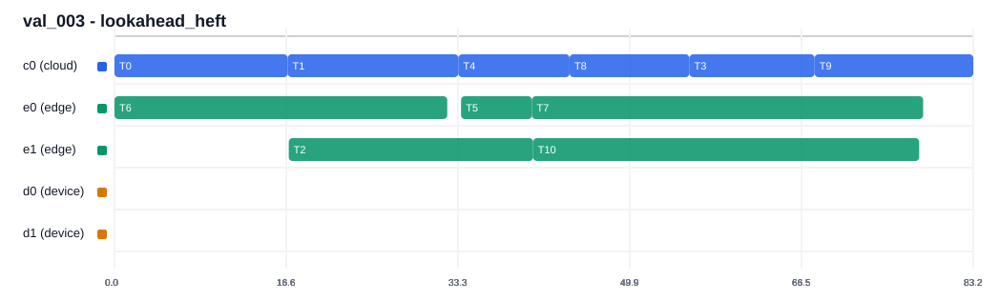
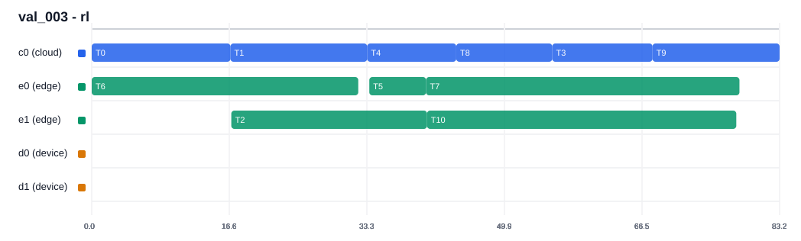
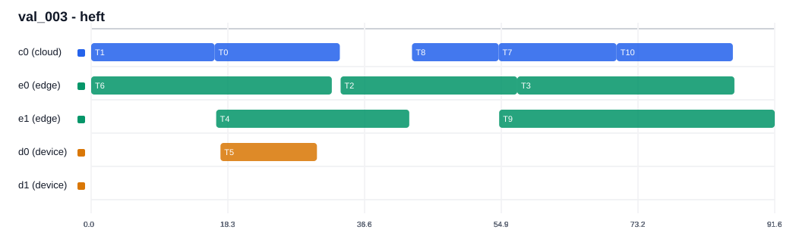
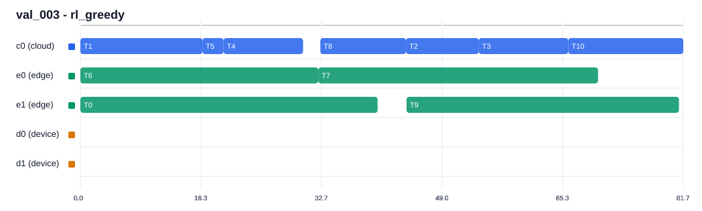
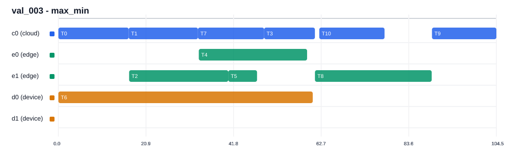
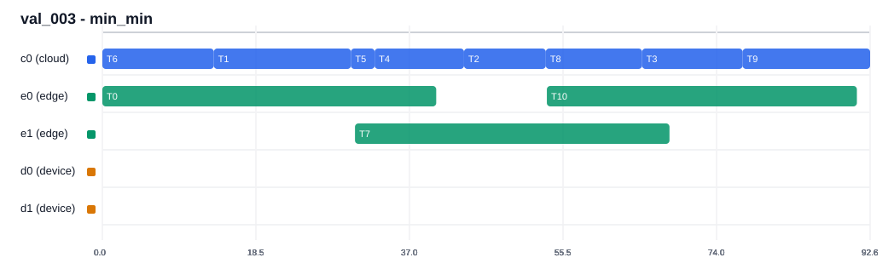
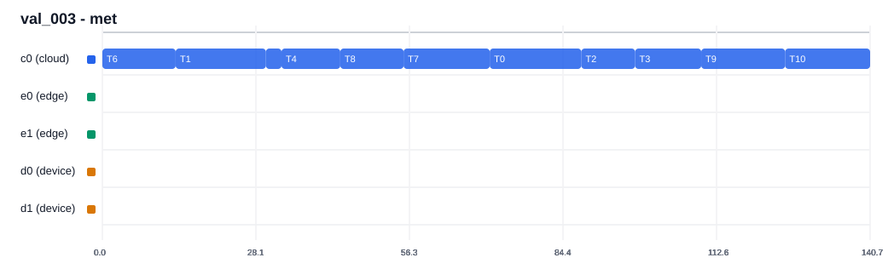
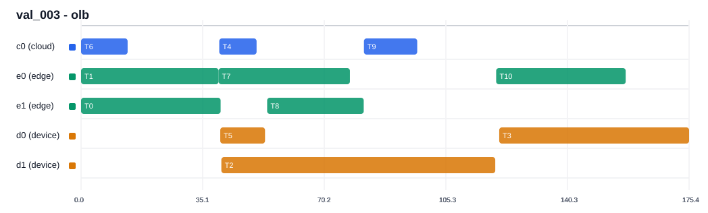
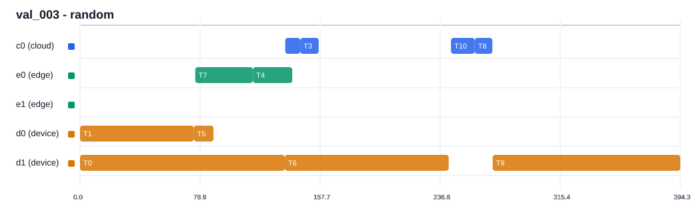

# Scheduler Visual Report

- config: `configs/default.json`
- selected scenario: `val_003`
- metric: `ratio_to_heft = policy_makespan / HEFT_makespan`

## Policy Ranking

| rank | policy | count | mean_ratio | std_ratio | mean_makespan |
|---:|---|---:|---:|---:|---:|
| 1 | lookahead_heft | 10 | 0.977684 | 0.032772 | 80.599650 |
| 2 | portfolio | 10 | 0.977684 | 0.032772 | 80.599650 |
| 3 | rl | 10 | 0.977684 | 0.032772 | 80.599650 |
| 4 | heft | 10 | 1.000000 | 0.000000 | 82.622597 |
| 5 | rl_greedy | 10 | 1.069420 | 0.083010 | 88.148012 |
| 6 | max_min | 10 | 1.081739 | 0.108763 | 89.264203 |
| 7 | rl_bc_only | 10 | 1.135747 | 0.098479 | 93.426430 |
| 8 | min_min | 10 | 1.170803 | 0.123810 | 96.160952 |
| 9 | mct | 10 | 1.170803 | 0.123810 | 96.160952 |
| 10 | met | 10 | 1.534784 | 0.331630 | 126.902856 |
| 11 | olb | 10 | 2.112796 | 0.639509 | 169.756110 |
| 12 | random | 10 | 4.687611 | 1.990610 | 371.959725 |

## Gantt Charts

### lookahead_heft

### portfolio

### rl

### heft

### rl_greedy

### max_min

### rl_bc_only

### min_min

### mct

### met

### olb

### random

